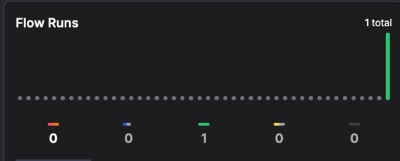
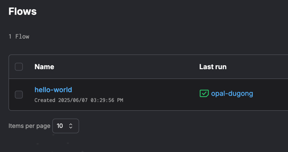

# prefect demo

# install

1. create a uv project python 3.13
2. install prefect

```shell
uv add prefect
```

3. check prefect version

```shell
prefect version
```

result should be something like:

```text
Version:             3.4.4
API version:         0.8.4
Python version:      3.13.1
Git commit:          0367d7aa
Built:               Thu, May 29, 2025 09:37 PM
OS/Arch:             darwin/arm64
Profile:             ephemeral
Server type:         ephemeral
Pydantic version:    2.11.5
Server:
  Database:          sqlite
  SQLite version:    3.45.3

```

# hello flow - the simplest prefect

start by creating the python hellow world script [hello_world.py](hello_world.py)

you can start of by writing a hello world main:

```python
def hello_world():
    print("Hello, world!")


if __name__ == '__main__':
    hello_world()
 ```

the next thing we are doing is transforming the hello world function to a flow by decorating it with the @flow decorator

[hello_flow.py](hello_flow.py)

```python
from prefect import flow


@flow
def hello_flow():
    print("Hello, world!")


if __name__ == '__main__':
    hello_flow()

```

### testing hello flow

to test hello flow run:

```shell
python hello_flow.py
```

and here are the results:

```shell
 python hello_flow.py 
11:05:23.075 | INFO    | prefect - Starting temporary server on http://127.0.0.1:8892
See https://docs.prefect.io/3.0/manage/self-host#self-host-a-prefect-server for more information on running a dedicated Prefect server.
11:05:24.736 | INFO    | Flow run 'annoying-kagu' - Beginning flow run 'annoying-kagu' for flow 'hello-flow'
Hello, world!
11:05:24.744 | INFO    | Flow run 'annoying-kagu' - Finished in state Completed()
11:05:24.758 | INFO    | prefect - Stopping temporary server on http://127.0.0.1:8892
```

Prefect runs your hello world on a temporary server; this is not a "production style" run.
Prefect detects that no orchestration server is configured or available for your flow, so it automatically starts a
temporary, local server (on a random port like 8827), runs your flow, and then shuts down the server.

• This temporary server is *NOT* the same as your main Prefect server running on port 4200.
• It is spun up just for this script run, and is destroyed immediately after.


If you want your flows to be orchestrated by the persistent server (the one on port 4200), you need to use deployments
and workers.

even though the server has stopped the collected data from the run session persists in prefect home directory at
`~/.prefect`

by default prefect persists its data into sqlite database

to view the flow run, we can start the prefect server:

# start the server

```shell
uvx prefect server start
```

alternatively you can...

# start Prefect with docker

```shell
docker run -d -p 4200:4200 prefecthq/prefect:3-latest -- prefect server start --host 0.0.0.0
```

open the ui to view the dashboard:

```shell
open http://127.0.0.1:4200/dashboard
```



then watch the flows

```shell
open http://127.0.0.1:4200/flows
```



# create a task

next let's create tasks.
a workflow can have tasks. tasks share the workflow context. and can return information in the same way functions
return values

here is a simple example:[hello_tasks.py](hello_tasks.py)

```python
from prefect import flow, task


@task
def create_hello() -> str:
    return "hello"


@task
def create_world() -> str:
    return "world"


@flow
def hello_tasks():
    hello = create_hello()
    world = create_world()
    print(f"{hello}, {world}!")


if __name__ == '__main__':
    hello_tasks()

```

run it with

```shell
python hello_tasks.py
11:42:01.388 | INFO    | prefect - Starting temporary server on http://127.0.0.1:8724
See https://docs.prefect.io/3.0/manage/self-host#self-host-a-prefect-server for more information on running a dedicated Prefect server.
11:42:03.064 | INFO    | Flow run 'hulking-aardwark' - Beginning flow run 'hulking-aardwark' for flow 'hello-tasks'
11:42:03.096 | INFO    | Task run 'create_hello-a4d' - Finished in state Completed()
11:42:03.125 | INFO    | Task run 'create_world-e75' - Finished in state Completed()
hello, world!
11:42:03.138 | INFO    | Flow run 'hulking-aardwark' - Finished in state Completed()
11:42:03.151 | INFO    | prefect - Stopping temporary server on http://127.0.0.1:8724
```

check the dashboard:


# deploying prefect flow to a prefect server

## start the prefect server

```shell
prefect server start
```

## Register (Deploy) Your Flow with the Server

Set the API URL so Prefect knows to use your server:

```shell
export PREFECT_API_URL=http://localhost:4200/api
```

## Create a deployment for your flow:

hello_flow.py is the name of the file where your flow is located
hello_flow is the @flow function name
hello-deployment is the name that you are giving to the deployment

```shell
prefect deploy hello_flow.py:hello_flow -n hello-deployment
```

once doing that you will be presented with a few questions

```shell
prefect deploy hello_flow.py:hello_flow -n hello-deployment
The following deployment(s) could not be found and will not be deployed: hello-deployment
Could not find any deployment configurations with the given name(s): hello-deployment. Your flow will be deployed with a new deployment configuration.
? Looks like you don't have any work pools this flow can be deployed to. Would you like to create one? [y/n] (y)
```

1. Looks like you don't have any work pools this flow can be deployed to. Would you like to create one? [y/n] (y): y
2. What infrastructure type would you like to use for your new work pool? [Use arrows to move; enter to select] process
3. Work pool name: my-pool
4. Would you like to configure schedules for this deployment? [y/n] (y): y
5. What type of schedule would you like to use? [Use arrows to move; enter to select] Interval
6. Seconds between scheduled runs (3600): 60
7. Would you like to activate this schedule? [y/n] (y): n
8. Would you like to add another schedule? [y/n] (n): n

what did we do?

* we have creating a new deployment named hello-deployment
* we created a work pool and gave it a name - meaning we have chosen an infrastructure where the flow will run. in this
  case a seperated process
* we configured a schedule for the deployment

To execute flow runs from the deployment, start a worker in a separate terminal that pulls work from the `my-pool` work
pool:

```shell
export PREFECT_API_URL=http://localhost:4200/api
prefect worker start --pool my-pool
```

to run the flow on the server:

```shell
prefect deployment run hello-flow/hello-deployment

Creating flow run for deployment 'hello-flow/hello-deployment'...
Created flow run 'affable-cicada'.
└── UUID: 9e428f2b-b061-4704-bfad-1ccfe2c271b9
└── Parameters: {}
└── Job Variables: {}
└── Scheduled start time: 2025-06-14 20:43:48 UTC+03:00 (now)
└── URL: http://localhost:4200/runs/flow-run/9e428f2b-b061-4704-bfad-1ccfe2c271b9
```

# Prefect Architecture with Work Pools

Prefect Server - Orchestrates flows, schedules, and deployments.
Work Pool - Defines the infrastructure for running flows (local, Docker, cloud, etc.).
Worker - Polls the work pool for flow runs and executes them.
Deployment - Registers your flow with the server and assigns it to a work pool.


## prefect server

prefect server acts as a Central orchestration hub
its Responsibilities are:
• Manages, schedules, and monitors data workflows (flows) defined by users.
• Stores metadata about flows, tasks, schedules, and their states.
• Provides a user interface and API for workflow management.
• Facilitates monitoring, alerting, and coordination of flow runs.
• Does not execute flows directly; instead, it orchestrates and delegates execution to external infrastructure

Think of Prefect Server as the “brain” that knows what needs to be run, when, and tracks the status of everything.

## work pools

work pools role is to bridge between orchestration and execution environments

a work pool is a logical configuration in Prefect that acts as a bridge between the orchestration layer (the server) and
the infrastructure where your flows actually execute. The work pool itself is just a configuration and queue—it does not
execute code or run flow

For most work pool types (like Process, Docker, Kubernetes, AWS ECS, etc.), you need to run a worker (or agent)
somewhere in your infrastructure. This worker polls the work pool for new flow runs and then executes them on the
specified infrastructur

Responsibilities:

* Collect and organize scheduled flow runs into queues, based on configuration (tags, deployments, etc.).
* Define the infrastructure and execution environment for running flows (e.g., Docker, Kubernetes, AWS ECS, local
  processes).
* Allow fine-grained control over how and where flows are executed, including infrastructure provisioning and resource
  limits.
* Serve as the channel from which agents or workers pick up work to execute flows.
* Support multiple operational modes (pull, push, managed) to fit different infrastructure needs

Work pools act as the “dispatchers,” determining which flows are ready to run and making them available for execution by
agents or workers.

## How They Work Together

* The Prefect Server schedules and tracks flow runs.
* Work Pools organize these runs and define how/where they should be executed.
* Agents/workers poll work pools for available flow runs and execute them on the specified infrastructure.

Analogy:

* Prefect Server: The central office that plans and tracks all deliveries.
* Work Pools: The various loading docks, each configured for different types of trucks and destinations.
* Agents/Workers: The trucks that come to the loading docks (work pools), pick up packages (flow runs), and deliver
  them (execute the flows).

# running the flow on a scheduler

for this you will need to edit the deployment

```shell
prefect deploy hello_flow.py:hello_flow -n hello-deployment -p my-pool --interval 60
```

once this is done take a look in the ui


# running tasks in parallel

By default, Prefect tasks are called synchronously when invoked like regular functions.
If you want to run these tasks in parallel, you'd need to use Prefect's parallel execution features

[parallel_tasks.py](parallel_tasks.py)

```python
from prefect import flow, task


@task
def create_hello() -> str:
    return "hello"


@task
def create_world() -> str:
    return "world"


@flow
def hello_tasks():
    hello_future = create_hello.submit()
    world_future = create_world.submit()
    print(f"{hello_future.result()}, {world_future.result()}!")


if __name__ == '__main__':
    hello_tasks()
```

The key differences are:
1. Using `.submit()` instead of calling the tasks directly
2. Using `.result()` to retrieve the values when needed

# is it possible to run a task on a dedicated infrastructure


