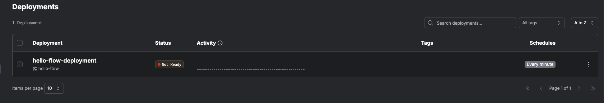

# prefect demo

# install

1. create a uv project python 3.13
2. install prefect

```shell
uv add prefect
```

3. Check Prefect version

```shell
prefect version
```

result should be something like:

```shell
Version:             3.4.4
API version:         0.8.4
Python version:      3.13.1
Git commit:          0367d7aa
Built:               Thu, May 29, 2025 09:37 PM
OS/Arch:             darwin/arm64
Profile:             ephemeral
Server type:         ephemeral
Pydantic version:    2.11.5
Server:
  Database:          sqlite
  SQLite version:    3.45.3

```

# Hello Flow - The Simplest Prefect Example

Start by creating a Python script for a simple "Hello, World!" example. Save this script as `hello_world.py`.

Begin by writing a standard "Hello, World!" function:

```python
def hello_world():
    print("Hello, world!")


if __name__ == '__main__':
    hello_world()
 ```

Now, let's transform this simple program into a Prefect flow by decorating the function with the `@flow` decorator. Save
the updated script as `hello_flow.py`.

[hello_flow.py](hello_flow.py)

```python
from prefect import flow


@flow
def hello_flow():
    print("Hello, flow!")


if __name__ == '__main__':
    hello_flow()

```

### Testing the `hello_flow`

To test the `hello_flow`, run the following command:

```shell
python -m hello_flow
```

You should see output similar to this:

```shell
python -m hello_flow                   
19:30:08.010 | INFO    | prefect - Starting temporary server on http://127.0.0.1:8842
See https://docs.prefect.io/3.0/manage/self-host#self-host-a-prefect-server for more information on running a dedicated Prefect server.
19:30:09.675 | INFO    | Flow run 'classic-quetzal' - Beginning flow run 'classic-quetzal' for flow 'hello-flow'
Hello, flow!
19:30:09.683 | INFO    | Flow run 'classic-quetzal' - Finished in state Completed()
19:30:09.698 | INFO    | prefect - Stopping temporary server on http://127.0.0.1:8842
```

When you execute the flow, Prefect automatically runs it on a temporary server. This server is used only for this
specific run and is considered a development or testing environment, *not* suitable for production use.

Here are some key points to note:

- Prefect detects that no orchestration server is configured or available, so it starts a temporary, local server (e.g.,
  on port 8842), executes your flow, and then shuts down the server immediately after the flow finishes.
- **The temporary server is different from your main Prefect server running on port 4200**. The main server is
  specifically for persistent orchestration and monitoring.

If you want your flows to be orchestrated by the persistent server (the one on port 4200), you need to use deployments
and workers.

Although the temporary server stops after the script completes, the metadata and logs from the flow run are saved. By
default, Prefect stores these in the `.prefect` directory within your home directory at `~/.prefect`.

Prefect uses an SQLite database by default to persist its data.

To view flow runs or set up orchestration for multiple runs, you'll need to start a Prefect server. Details on how to do
this are provided in subsequent sections.

# start the server

```shell
uvx prefect server start
```

alternatively you can...

# start Prefect with docker

```shell
docker run -d -p 4200:4200 prefecthq/prefect:3-latest -- prefect server start --host 0.0.0.0
```

open the ui to view the dashboard:

```shell
open http://127.0.0.1:4200/dashboard
```


You can see that there is one flow run and zero tasks. This is because no tasks were defined in the flow.

Click on **Runs** to view the flow runs. You should see a single flow run listed.

Next, click on **Flows**, or open the following URL in your browser:

```shell
open http://127.0.0.1:4200/flows
```


Here, you can observe a single flow listed, with no deployments defined.

# Creating a Task

Next, let's create tasks for the workflow.
In a workflow, tasks are individual units of work that share the workflow context. Similar to functions, tasks can
return values that can be used elsewhere in the workflow.

Here is a simple example: [hello_tasks.py](hello_tasks.py)

```python
from prefect import flow, task


@task
def create_hello() -> str:
    return "hello"


@task
def create_world() -> str:
    return "world"


@flow
def hello_tasks():
    hello = create_hello()
    world = create_world()
    print(f"{hello}, {world}!")


if __name__ == '__main__':
    hello_tasks()

```

run it with `python -m hello_tasks`

```shell
python -m hello_tasks 
21:17:26.969 | INFO    | prefect - Starting temporary server on http://127.0.0.1:8874
See https://docs.prefect.io/3.0/manage/self-host#self-host-a-prefect-server for more information on running a dedicated Prefect server.
21:17:28.628 | INFO    | Flow run 'primitive-nautilus' - Beginning flow run 'primitive-nautilus' for flow 'hello-tasks'
21:17:28.661 | INFO    | Task run 'create_hello-ff1' - Finished in state Completed()
21:17:28.687 | INFO    | Task run 'create_world-fda' - Finished in state Completed()
hello, world!
21:17:28.699 | INFO    | Flow run 'primitive-nautilus' - Finished in state Completed()
21:17:28.713 | INFO    | prefect - Stopping temporary server on http://127.0.0.1:8874
```

at the very least, using tasks instead of simple function can give you:

* Execution traching - understand the time each task takes
* State monitoring - what is the state of each task
* Web ui visibility - and all of this is visible in the ui

Click on **Dashboard**. You should see two flow runs listed and two Task runs.


click on **Runs** -> Task Runs


# task retries

```python

from prefect import task
import requests


@task(retries=3, retry_delay_seconds=10)
def unreliable_api_call():
    # If this fails, Prefect will retry 3 times with 10-second delays
    response = requests.get("https://flaky-api.com")
    return response.json()

```

# task caching

```python
from prefect import task
from datetime import timedelta


@task(cache_expiration=timedelta(hours=10))
def expensive_computation() -> bytes:
    # do expensive computation
    return b"world"
```

# running tasks in parallel

By default, Prefect tasks are called synchronously when invoked like regular functions.
If you want to run these tasks in parallel, you'd need to use Prefect's parallel execution features

[parallel_tasks.py](parallel_tasks.py)

```python
from prefect import flow, task


@task
def create_hello() -> str:
    return "hello"


@task
def create_world() -> str:
    return "world"


@flow
def parallel_tasks():
    hello_future = create_hello.submit()
    world_future = create_world.submit()
    print(f"{hello_future.result()}, {world_future.result()}!")


if __name__ == '__main__':
    parallel_tasks()
```

The key differences are:

1. Using `.submit()` instead of calling the tasks directly
2. Using `.result()` to retrieve the values when needed

# Deploying a Prefect Flow to a Prefect Server

Up until now, we have been testing our flows on a temporary server. But how can we run a flow automatically on a
schedule?

To do that first, we need to understand Prefect architecture


# Prefect Architecture


This simplified component diagram shows the two main layers:

## Orchestration Layer (Blue):

Prefect Server handles scheduling and coordination
Work Queues manage flow run assignments
Flow Storage contains your flow definitions

## Execution Layer (Green/Orange):

Workers poll for work and manage execution
Flow Runtime executes tasks with their dependencies

The key interaction is that workers pull work from the orchestration layer, fetch flow code from storage, execute it
locally, then report results back up to the server. This clean separation allows centralized orchestration with
distributed execution.

## work pools as infrastructure templates


Work Pools (orange) sit in the orchestration layer and serve as the bridge between scheduling and execution. They define
the "contract" for how flows should be executed


* Process work pool: "Run flows as local processes on the worker machine"
* Docker work pool: "Run flows inside Docker containers with these specs"
* Kubernetes work pool: "Run flows as K8s jobs with these resource limits"

### The Flow from Orchestration to Execution

1. Server schedules flows and assigns them to specific work pools
2. Work pools create their own work queues and define execution requirements
3. Workers poll queues belonging to work pools they're configured for
4. Work pools tell workers exactly how to set up the execution environment
5. Workers execute the flow runtime according to the work pool's specifications

## Deployments

Deployments are configuration objects that connect your flow code to the execution infrastructure.
Deployments tell Prefect:

* What to run: Which specific flow and version
* When to run it: Schedules, triggers, or manual execution
* Where to find it: Location in flow storage (Git repo, S3 bucket, Local File System, etc.)
* How to run it: Which work pool to use for execution
* With what settings: Parameters, environment variables, resource requirements


# Deploying a Prefect Flow to a Prefect Server

Now that we understand Prefect architecture we can go back to our original question.

how can we run a flow automatically on a schedule?

## Starting the Prefect Server

If you do not already have a Prefect server running, start it now:

```shell
prefect server start
```

## Setting the API URL

Configure the API URL so Prefect knows to connect to your server:

```shell
export PREFECT_API_URL=http://localhost:4200/api
```

## Registering (Deploying) Your Flow with the Server

To deploy your flow, use the following command. 

```shell
prefect deploy hello_flow.py:hello_flow -n hello-flow-deployment
```

`hello_flow.py` is the name of the file where your flow is located
`hello_flow` is the @flow function name
`hello-flow-deployment` is the name that you are giving to the deployment

Upon running the command, you will be prompted with a few questions:

```shell
prefect deploy hello_flow.py:hello_flow -n hello-flow-deployment
Unable to read the specified config file. Reason: [Errno 2] No such file or directory: 'prefect.yaml'. Skipping.
? Looks like you don't have any work pools this flow can be deployed to. Would you like to create one? [y/n] (y): y
? What infrastructure type would you like to use for your new work pool? [Use arrows to move; enter to select]
<select process>
? Work pool name: my-pool
Your work pool 'my-pool' has been created!
? Your Prefect workers will need access to this flow's code in order to run it. Would you like your workers to pull your flow code from a remote storage location when running this flow? [y/n] (y): n
Your Prefect workers will attempt to load your flow from: /Users/yoavbenishai/work/playground/prefect-demo/hello_flow.py. To see more options for managing your flow's code, run:
...
? Would you like to configure schedules for this deployment? [y/n] (y): y
? What type of schedule would you like to use? [Use arrows to move; enter to select]
<select Interval>
? Seconds between scheduled runs (3600): 60
? Would you like to activate this schedule? [y/n] (y): n
? Would you like to add another schedule? [y/n] (n): n
...
? Would you like to save configuration for this deployment for faster deployments in the future? [y/n]: y
Deployment configuration saved to prefect.yaml! You can now deploy using this deployment configuration with:

        $ prefect deploy -n hello-flow-deployment

You can also make changes to this deployment configuration by making changes to the YAML file.

To execute flow runs from these deployments, start a worker in a separate terminal that pulls work from the None work pool:

        $ prefect worker start --pool None

To schedule a run for this deployment, use the following command:

        $ prefect deployment run 'hello-flow/hello-flow-deployment'

```

|                                         |          |                                       |
|-----------------------------------------|----------|---------------------------------------|
| create work pull                        | y        |                                       |
| infrastructure type                     | process  |                                       |
| Work pool name                          | my-pool  |                                       |
| pull your flow code from remote storage | n        |                                       |
| configure schedule                      | y        |                                       |
| schedule type                           | Interval |                                       |
| seconds between schedule runs           | 60       |                                       |
| activate schedule                       | n        |                                       |
| add another schedule                    | n        |                                       |
| save configuration                      | y        | add the configuration to prefect.yaml |

What Did We Do?

- We created a new deployment named `hello-flow-deployment`.
- We created a work pool and assigned it a name, specifying the infrastructure where the flow will run. In this case, we
  chose a separate process.
- your deployment definition was added to prefect.yaml

check your deployment definition in the newly created [prefect.yaml](prefect.yaml)

```yaml
deployments:
  - name: hello-flow-deployment
    version: null
    tags: [ ]
    concurrency_limit: null
    description: null
    entrypoint: hello_flow.py:hello_flow
    parameters: { }
    work_pool:
      name: my-pool
      work_queue_name: null
      job_variables: { }
    schedules:
      - interval: 60.0
        anchor_date: '2025-06-20T06:52:03.773746+00:00'
        timezone: UTC
        active: false
```

Click on **Deployments**. You should see the newly created deployment



Note the status: Not Ready - this means there are no workers attached to the deployment work pool

## Running Flow Runs from the Deployment

To execute flow runs from the deployment, start a worker in a separate terminal to pull work from the `my-pool` work
pool:

```shell
export PREFECT_API_URL=http://localhost:4200/api
prefect worker start --pool my-pool
```

You should see output similar to this:

```shell
Discovered type 'process' for work pool 'my-pool'.
Worker 'ProcessWorker 99d28b8d-5afe-4392-8101-5726eddd892d' started!
```

This log confirms that a worker has been successfully started and is now ready to execute flow runs by pulling work from
the `my-pool` work pool. Any flow runs scheduled for this work pool will be picked up and executed using the `process`
infrastructure.

Click on **Deployments**. You should see the deployment status has changed to Ready


## Running the Flow on the Server

To run the flow on the server, use the following command:

```shell
prefect deployment run hello-flow/hello-flow-deployment         
```

You should see output similar to this:

```shell
Creating flow run for deployment 'hello-flow/hello-flow-deployment'...
Created flow run 'garnet-chamois'.
└── UUID: 4ea2b380-2b78-45c8-b9b4-726a13c59b5c
└── Parameters: {}
└── Job Variables: {}
└── Scheduled start time: 2025-06-20 06:40:38 UTC+03:00 (now)
└── URL: http://localhost:4200/runs/flow-run/4ea2b380-2b78-45c8-b9b4-726a13c59b5c
```

Click on **Runs**. You should see a new entry for the flow run.


# Running the Flow on a Schedule

To enable your flow to run automatically on a defined schedule, you have several options:

## Option 1: Deploy with Schedule via CLI

You can create a deployment with a schedule directly using the CLI:

```shell
prefect deploy hello_flow.py:hello_flow -n hello-flow-deployment -p my-pool --interval 60
```

This command:

- Creates a deployment named `hello-flow-deployment`
- Assigns it to the work pool `my-pool`
- Sets it to run every 60 seconds
- Automatically activates the schedule

## Option 2: Activate Schedule in prefect.yaml (Recommended)

Since we already have a schedule defined in our [prefect.yaml](prefect.yaml) file, we'll use this approach. Simply set
the `active` property to `true`:

```yaml
deployments:
  - name: hello-flow-deployment
    version: null
    tags: [ ]
    concurrency_limit: null
    description: null
    entrypoint: hello_flow.py:hello_flow
    parameters: { }
    work_pool:
      name: my-pool
      work_queue_name: null
      job_variables: { }
    schedules:
      - interval: 60.0
        anchor_date: '2025-06-20T06:52:03.773746+00:00'
        timezone: UTC
        active: true

```

After making this change, redeploy your flow:

```yaml
prefect deploy -n hello-flow-deployment
```

the output:

```shell
prefect deploy -n hello-flow-deployment
╭─────────────────────────────────────────────────────────────────────────────────────────────────────────────────────────────────────────────────────────────────────────────────────────────────────────────────────────────────╮
│ Deployment 'hello-flow/hello-flow-deployment' successfully created with id '38fbef46-1f26-4c53-b4bd-9995dbe0fd71'.                                                                                                              │
╰─────────────────────────────────────────────────────────────────────────────────────────────────────────────────────────────────────────────────────────────────────────────────────────────────────────────────────────────────╯

View Deployment in UI: http://localhost:4200/deployments/deployment/38fbef46-1f26-4c53-b4bd-9995dbe0fd71

```

This method is preferred because it keeps all deployment configuration centralized in the file, making it easier to
version control and manage.

## Verify Schedule Activation

Once configured, you can verify your scheduled deployment is active by Checking the Prefect UI
at [http://localhost:4200/deployments](http://localhost:4200/deployments)

# Q&A

## is it possible to run a task on a dedicated infrastructure?

In Prefect, tasks cannot be assigned dedicated infrastructure independently. Task execution occurs within the
infrastructure provisioned for the entire flow run, not per-task. Here’s how infrastructure allocation works:

While tasks share the flow’s infrastructure, you can use task runners to parallelize task execution within that
environment

Supported runners: `DaskTaskRunner`, `RayTaskRunner`, `ConcurrentTaskRunner`
